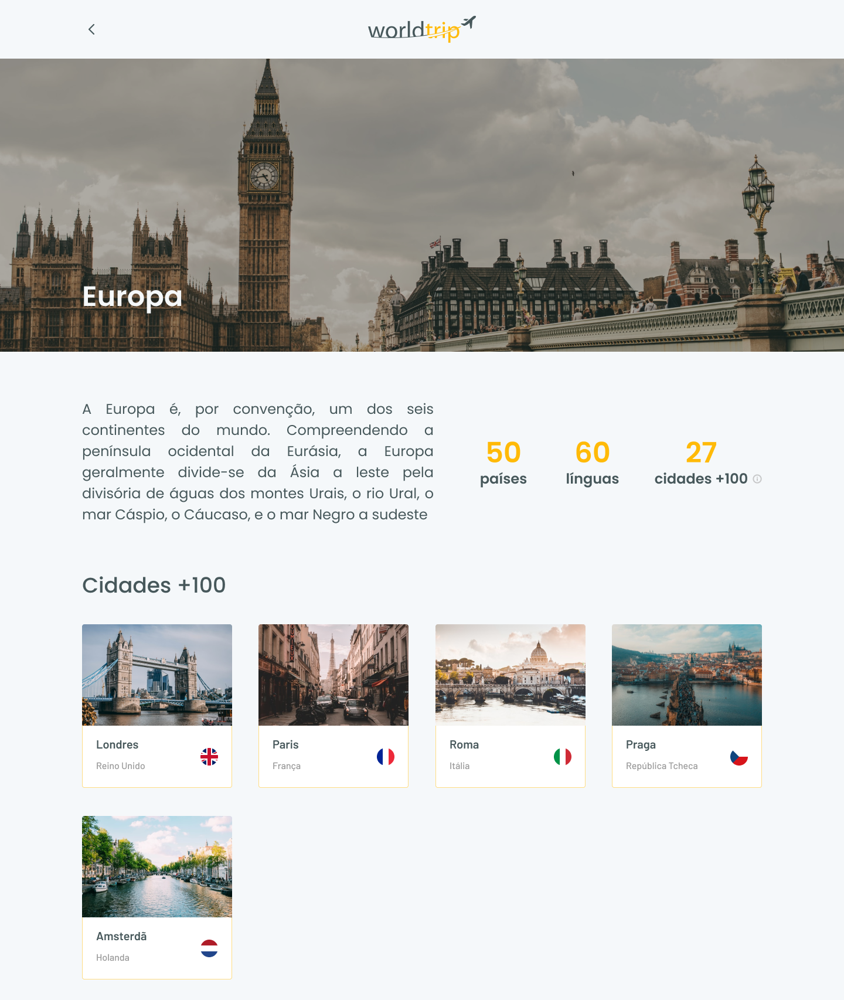

<div id="top" align="center">
  <div>
    
  </div>
  <h4 align="center">worldtrip | Mobile first interface created using using Next.js and ChakraUi</h4>
</div>

## Resumo

  <ol>
    <li><a href="#visão-geral-do-projeto">Visão geral do projeto</a></li>
    <li><a href="#sobre-o-projeto">Sobre o projeto</a></li>
    <li><a href="#tecnologias-utilizadas">Tecnologias utilizadas</a></li>
    <li><a href="#instalação-e-utilização">Instalação e utilização</a></li>
    <li><a href="#licença">Licença</a></li>
    <li><a href="#agradecimentos">Agradecimentos</a></li>
  </ol>

## Visão geral do projeto

<div>
  <h3 >
    
    <a href="https://www.figma.com/file/8QAkMs3BddatXn2fFseyu4/Desafio-1-M%C3%B3dulo-4-ReactJS/duplicate?node-id=0%3A1">Layout no Figma</a>
  </h3>
</div>

<div align="center">
    
    
    
</div>

## Sobre o projeto

World Trip é uma aplicação que oferece informações detalhadas sobres os mais diversos destinos ao redor do globo. Escolha
um pais, encontre atividades e planege sua viagem como nunca. Aplicando boas práticas para o desenvolvimento de interfaces 
focadas em dispositivos móveis de tela pequena, e tornando o mesmo adaptável para telas maiores em desktops. Toda a interface
foi construida usando ChakraUI, pensando na usabilidade e responsividade, entregando ao usuário uma experiência simples e agradável. 

## Tecnologias utilizadas

As principais tecnologias utilizadas na construção deste projeto foram: 

* [Next.js](https://nextjs.org/)
* [Chakra UI](https://chakra-ui.com/guides/getting-started/nextjs-guide)
* [Swiper](https://swiperjs.com/react)

## Instalação e utilização

Instruções de instalação do projeto em seu computador.

### Pré-requisitos

Clone este repositório utilizando o comando a seguir. Lembre-se, você deve possuir a CLI do git instalada em seu computador.

```sh
git clone https://github.com/ivanvinicius/worldtrip.git
```
Para que seja possível fazer o download das depêdencias do projeto, recomendamos a utilização de um package mananger:

* [Yarn (Recomendado para este projeto)](https://classic.yarnpkg.com/lang/en/docs/install/#debian-stable)
* [Npm](https://nodejs.org/en/)
  
### Instalação

1. Dentro da pasta do projeto, rode o comando ```yarn``` para fazendo o download da depêndencias.

2. Rode o comando ```yarn dev``` para executar o projeto em seu localhost:3000.

## Licença

 O projeto ainda não contém nenhuma licença. ⚠️

## Agradecimentos

* [Rocketseat Education - Boosting People.](https://www.rocketseat.com.br/)

<br/>
<h4 align="center"><a href="#top">Voltar ao Início</a></h4>

<p align="right">"Estabilidade não existe" - Flavio Augusto</p>